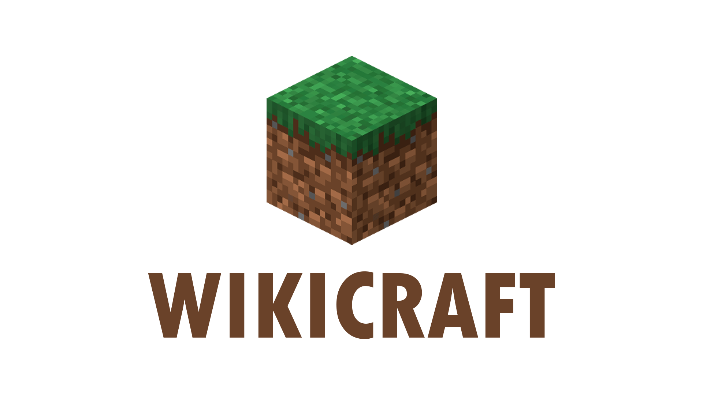

# WikiCraft

  

  

## Description
A program developed with the technology [VB.Net]. With a nice layout, you don't need an internet connection to work.
  
When selecting the version you want, the program informs the name, the release date, as well as general details about it.

## Currently 
The program shows an overview of all Minecraft updates, ranging from the first official version (1.0) to the most recent (1.17).
The program contains cover art, music and a loading screen.

## Coming soon
I plan to make a complete wiki about every block, animal, monster, curiosity, new languages and more. I will be launching the program here as I update.

## Download
You can already use the latest version of WikiCraft in the releases part.
https://github.com/Jolonte/WikiCraft/releases/tag/v1.0
