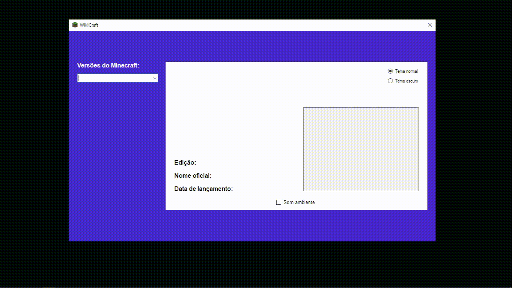

# Minecraft Wiki

Bem-vindo ao repositório do meu projeto "Minecraft Wiki"! Aqui, criei uma Wiki para todas as versões do Minecraft (1.17 na época). Passeie pela caverna da informação e descubra que, assim como no jogo, até mesmo a Wiki tem um tema escuro. Obs: Não há creepers, apenas conhecimento explosivo!

## Visão Geral

<p align="center">
  

Este projeto é uma iniciativa educativa para fornecer informações abrangentes sobre o universo do Minecraft. A Wiki aborda todas as versões, destacando recursos, blocos, criaturas e muito mais, proporcionando uma fonte de conhecimento para jogadores e entusiastas.

## Tecnologias Utilizadas

- **VB.net:** Uma linguagem de programação versátil e orientada a objetos.
- **Windows Forms:** Um conjunto de ferramentas para o desenvolvimento de interfaces gráficas no ambiente Windows.

## Funcionalidades

1. **Exploração de Versões:**
   - Navegue pelas diferentes versões do Minecraft para acessar informações específicas.

2. **Detalhes sobre Recursos:**
   - Informações detalhadas sobre blocos, itens, criaturas e recursos do jogo.

3. **Pesquisa Eficiente:**
   - Utilize a função de pesquisa para encontrar rapidamente informações específicas.

## Como Testar

1. **Clone o Repositório:**
   ```bash
   git clone https://github.com/viniciusnevescosta/schoolwork-bmi-calculator.git
   ```

2. **Abra o Projeto no Visual Studio:**
   - Abra o projeto no Visual Studio (ou em um ambiente de desenvolvimento compatível com VB.net).

3. **Execute o Projeto:**
   - Compile e execute o projeto para iniciar a Minecraft Wiki.

4. **Explore a Wiki:**
   - Navegue pelas versões, pesquise informações e aproveite a Wiki do Minecraft.

## Aprendizados Adquiridos

Durante o desenvolvimento deste projeto, adquiri conhecimentos importantes, incluindo:

- 🖥 Desenvolvimento de uma aplicação Wiki interativa usando VB.net e Windows Forms.
- 🎨 Implementação de um tema escuro para melhorar a experiência visual.

---

**Nota:** Este projeto foi arquivado pois representa um estudo concluído com sucesso. Não há planos de desenvolvimento adicional, pois seus objetivos foram alcançados com êxito.
